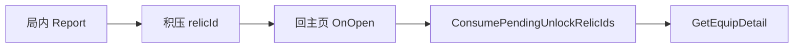

# 遗物解锁

账号累计 `UnlockConditionConfig` 进度，达标解锁对应遗物。局内新解锁先积压，回主页弹 [`GetEquipDetail.md`](../UI/Popup/GetEquipDetail.md)，局内不弹 Toast。

接口：`Assets/App/Unlock/IUnlockConditionService.cs`  
实现：`Assets/App/Unlock/UnlockConditionService.cs`  
存档键：`unlock.condition.v1`  
配置：`UnlockConditionConfig` / `RelicConfig.UnlockConditionId`

---

## 规则

| 项 | 说明 |
|----|------|
| 默认解锁 | `UnlockConditionId ≤ 0` 视为已解锁 |
| 进度 | 按条件 Id 账号累计，落盘后配置改严也不会回锁 |
| 累加类 | `progress += amount × StackedValue` |
| 取最大类 | `ClearDifficulty` / `NumberOfCoinsOwned` / `OneDamage` / `SingleDamage`：`progress = max(当前, amount)` |
| 商店货池 | `BeginRun` 打开局快照；局内新解锁要等**下次闯关**才进店 |

---

## API

```csharp
bool IsRelicUnlocked(int relicId);
int GetProgress(int conditionId);
bool IsRelicInShopPool(int relicId);
void BeginRun();
void Report(ContidionType type, int amount = 1);
IReadOnlyList<int> ConsumePendingUnlockRelicIds();
void Load();
void Save(); // ISaveFlushable
```

- `Report`：遍历同 `ContidionType` 的条件行更新进度；新达标遗物 Id 写入积压列表。
- `ConsumePendingUnlockRelicIds`：按解锁顺序取出并清空；由 `HomeViewModel` 在打开主页时调用。

---

## 提示时机



局内（对局 / 商店 / 结算页）全程不弹解锁 UI。积压只在内存，不落盘；进程中断未回主页则本次提示丢失，解锁状态仍已存档。

---

## 图鉴与商店

- 图鉴遗物页：live 读 `IsRelicUnlocked` / `GetProgress`，未解锁显示遮罩与带进度的解锁提示。
- 商店：`IsRelicInShopPool` 过滤货架；与图鉴解锁态可不同步到下一局。
